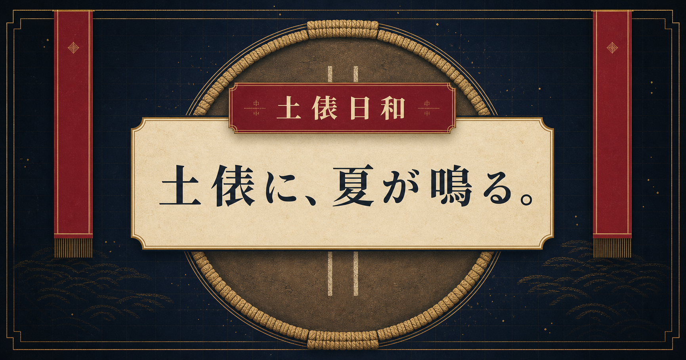

# 相撲日和 / Sumo Biyori

[English README](./README.md)

> 大相撲の取組速報、1958年以降の取組から再計算したレーティング、透明な勝率予測、歴代比較、GPT-5.6による見どころ解説を統合した日英対応の相撲観戦サイトです。

[](https://dohyo-biyori.uwaaaan.chatgpt.site/)

**[公開サイト](https://dohyo-biyori.uwaaaan.chatgpt.site/)** · **[ソースコード](https://github.com/Naruse0208/sumo-biyori)**

## 相撲日和が解決すること

大相撲の公式情報は豊富ですが、当日の取組、力士の背景、現在の強さ、勝率予測、歴代比較は別々に確認する必要があります。相撲日和は、それらを日本と海外のファンが一つの体験として楽しめるようにまとめます。

本プロジェクトは、AIを置いただけのサイトではありません。中核に構造化された相撲データとレーティング基盤があり、GPT-5.6は確認済みの試合情報を、架空の数値を作らず観戦向けの文章へ変換します。

## 主な機能

- 当日の全六段の取組進行、結果、次の一番
- 1958年以降の取組から再計算したElo・Glicko-2
- 同場所・同段の中での傑出度を示す相撲偏差値
- 事前勝率の表示と、終了後にも予測を残す答え合わせ
- 力士プロフィール、レート推移、対戦比較、予測モデル検証、歴代指数、横綱比較
- GPT-5.6による「東力士・西力士・勝負の焦点」の日英3項目の見どころ解説
- 日本語／英語表示、PC・タブレット・スマートフォン対応

## OpenAI Build Week

相撲日和はCodexとともに開発し、実際に動作する機能としてGPT-5.6を利用しています。

### Codexをどう利用したか

Codexは共同開発エージェントとして、プロジェクト全体で次の作業に使用しました。

- 公式の取組・番付・力士データの調査と正規化
- 利用者数に応じて公式サイトへのアクセスが増えない中央D1キャッシュの設計
- 歴史的レーティングの再計算基盤と研究ページの実装
- ブラウザ上のフィードバックを反映した日英UIとレスポンシブ対応
- 力士同定、画面遷移、キャッシュ、プロフィール画面などの不具合調査
- テスト、書き込み保護、構造化AI出力、生成先切替、安全な定型文フォールバックの実装
- 生成コードをそのまま採用せず、制作者と重要な設計判断を相談しながら検証

レーティングの定義、計算処理とAI文章の分離、解説対象の取組、下位段優先の生成順、失敗時の方針は、人間が決定した重要事項です。

### GPT-5.6をどう利用しているか

GPT-5.6を利用するのは、取組カードに表示する「この一番の見どころ」の文章だけです。サーバーは次の情報から、試合ごとの事実JSONを作ります。

- 場所、日目、段位、番付、今場所の勝敗
- 力士IDと日英の四股名
- Elo、Glicko-2、推定幅、身長、体重
- 予測勝率、信頼度、記録済みの直接対戦

事実JSONを固定指示とともにOpenAI Responses APIへ渡し、厳格なJSON Schemaで、東力士・西力士・勝負の焦点の3項目を日本語と英語で返させます。出力は再検証してD1の`bout_highlights`へ保存し、全利用者が同じ生成結果を参照します。

```text
日本相撲協会の公開情報
        │
        ▼
中央D1キャッシュ・力士同定DB
        │
        ├──► 決定的なレート計算・勝率予測
        │
        ▼
確認済みの試合事実JSON
        │
        ▼
GPT-5.6 + 厳格な構造化出力
        │
        ▼
D1のbout_highlights ──► 日英の公開画面
```

入力例（短縮版）：

```json
{
  "bashoId": 202607,
  "day": 8,
  "division": { "id": 1, "nameJa": "幕内" },
  "east": {
    "nameJa": "大の里",
    "nameEn": "Onosato",
    "rankJa": "東横綱",
    "wins": 6,
    "losses": 1,
    "elo": 2300,
    "glicko2": 1910
  },
  "west": {
    "nameJa": "豊昇龍",
    "nameEn": "Hoshoryu",
    "rankJa": "西横綱",
    "wins": 5,
    "losses": 2,
    "elo": 2350,
    "glicko2": 1906
  },
  "matchup": {
    "eastWinProbability": 52,
    "westWinProbability": 48,
    "confidence": "high"
  }
}
```

出力形式：

```json
{
  "east": { "ja": "…", "en": "…" },
  "west": { "ja": "…", "en": "…" },
  "key": { "ja": "…", "en": "…" }
}
```

### GPT-5.6が行わないこと

Elo、Glicko-2、相撲偏差値、勝率、取組結果、勝敗数はアプリケーションのコードで計算または取得します。GPT-5.6はこれらを作成・変更しません。与えられた事実だけを説明し、怪我、昇進条件、連勝、決まり手、発言、過去の出来事を推測しないよう固定指示で禁止しています。

## 信頼性と安全性

- APIキーと見どころ生成用トークンはサーバー側だけで保持
- 一般公開APIは読み取り専用で、生成処理には管理用Bearerトークンが必要
- 公式情報を取得する場所を中央キャッシュに限定し、利用者は共有D1データを参照
- AI出力をJSON Schemaで制約し、保存前にアプリ側でも検証
- 最大5取組のバッチ生成と、事実・プロンプト・スキーマ・取組IDによる重複防止
- API障害や制限到達時は、エラー表示ではなく決定的な日英定型文を保存
- 毎日05:00 JST以降、下位段から上位段へ生成し、未完了分は10分間隔で再試行

## 技術構成

- Next.js 16、React 19、TypeScript、vinext
- Cloudflare Workers、D1
- Drizzle ORM
- OpenAI Responses API、GPT-5.6
- 同じ事実・出力形式で切り替えられるGemini接続
- Node.js標準テストランナー

## ローカルセットアップ

### 必要なもの

- Node.js 22.13以上
- npm
- 新しいAI解説を生成する場合のみOpenAI APIキー

### 1. インストール

```bash
git clone https://github.com/Naruse0208/sumo-biyori.git
cd sumo-biyori
npm install
```

### 2. ローカル用シークレット

`.env.example`を`.env.local`としてコピーし、自分の値を設定します。`.env.local`はGitへ追加しないでください。

```env
AI_PROVIDER=openai
OPENAI_MODEL=gpt-5.6-luna
OPENAI_API_KEY=your_openai_api_key
AI_HIGHLIGHT_ADMIN_TOKEN=choose_a_private_admin_token
```

事実JSON、出力スキーマ、画面、DB形式を変えずGeminiへ切り替えることもできます。

```env
AI_PROVIDER=gemini
GEMINI_MODEL=gemini-2.5-flash-lite
GEMINI_API_KEY=your_gemini_api_key
AI_HIGHLIGHT_ADMIN_TOKEN=choose_a_private_admin_token
```

生成AIの認証情報がなくても、AI以外の画面、同梱された歴史データ、安全な定型文フォールバックはローカルで確認できます。

### 3. 起動

```bash
npm run dev
```

開発サーバーに表示されたローカルURLを開きます。開発環境ではプロジェクト用のD1バインディングが用意され、本番用D1とシークレットはSites側で別途設定されます。

### 4. ビルドとテスト

```bash
npm run build
npm test
```

個別のテストも実行できます。

```bash
node --test tests/rendered-html.test.mjs
node --test tests/glicko2.test.mjs
node --test tests/model-lab.test.mjs
```

## GPT-5.6の生成処理を試す

1. OpenAI用の環境変数を設定してアプリを起動します。
2. トップページを一度開き、共有の当日取組データを準備します。
3. 信頼できるサーバーまたはターミナルから、保護された生成処理を呼びます。

```bash
curl -X POST http://localhost:3000/api/admin/generate-highlights \
  -H "Authorization: Bearer $AI_HIGHLIGHT_ADMIN_TOKEN" \
  -H "Content-Type: application/json" \
  -d '{"batchSize":5}'
```

4. トップページで対象取組を表示するか、次の読み取り専用APIで確認します。

```text
GET /api/highlights?bashoId=<id>&day=<day>&division=<division>&east=<nskId>&west=<nskId>
```

当日の取組が全段揃うまでは生成を待機します。現在の事実・プロンプト・スキーマで生成済みの文章は再利用されます。

## 同梱サンプルデータ

審査とローカル確認に使える、秘密情報を含まない生成済みデータを同梱しています。

- `data/ratings-latest.json`：最新レートの概要
- `data/model-evaluation.json`：未学習期間での予測検証結果
- `data/era-rankings.json`：実験的な歴代指数
- `data/featured-risers.json`：前場所からレートを伸ばした力士
- `public/rating-model-v2/`：場所ごとの歴史的レート
- `public/rating-seed/`：本番DB投入用の圧縮データ

## 主な開発用コマンド

```bash
npm run ratings:build   # 歴史レーティングを再構築
npm run ratings:lab     # 予測モデル検証データを再構築
npm run ratings:audit   # 取り込んだレートデータを監査
npm run db:generate     # スキーマ変更後のマイグレーション生成
```

生成済みデータをリポジトリへ同梱しているため、提出アプリの起動に大規模な再計算は必要ありません。

## データ、出典、現在の限界

取組、番付、力士プロフィールの出典は[日本相撲協会公式サイト](https://www.sumo.or.jp/)です。相撲日和は日本相撲協会の公認・公式サービスではありません。

レーティング、勝率、歴代指数、AI解説は、観戦を深く楽しむための独自推定・編集情報です。公式結果ではなく、賭博その他の金銭判断を目的としません。歴代指数は同時代の力士に対する傑出度を測るものであり、異なる時代の力士が実際に対戦した場合の勝敗を証明するものではありません。

取得元HTMLや力士写真はリポジトリへ再配布していません。第三者の名称、標章、元データに関する権利は各権利者に帰属します。

## ディレクトリ構成

```text
app/                 画面、API、予測処理、AI連携
db/                  D1スキーマ、共有キャッシュ
drizzle/             DBマイグレーション
worker/              Worker入口、AI生成スイープ
scripts/             レート、検証、DB投入、四股名補完
data/                研究・表示用の生成済みデータ
public/               歴史レートと画像
tests/                表示、レート、モデル、統合テスト
docs/ai-highlights.md AI生成の詳細
```

## 詳細資料

- [AI見どころ生成](./docs/ai-highlights.md)
- [OpenAI GPT-5.6ガイド](https://developers.openai.com/api/docs/guides/latest-model?model=gpt-5.6)
- [Codexドキュメント](https://learn.chatgpt.com/docs)

## ライセンス

本リポジトリで独自に制作したソースコードは、Copyright © 2026 Naruse0208として[MITライセンス](./LICENSE)で公開します。

MITライセンスが適用されるのは本プロジェクト独自のソースコードです。第三者の名称、標章、元データなどは、それぞれの権利および利用条件に従います。

## 免責事項

OpenAI Build Week向けに制作した、非公式・非商用のファン／研究プロジェクトです。APIキー、シークレット、個人の非公開情報はリポジトリに含みません。
